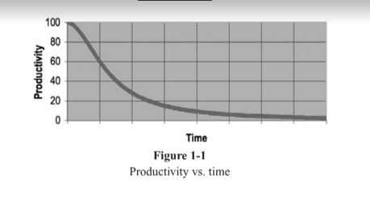

# Clean Code - Robert C. Martin

   - Not a **feel good** book.
   - Learning Craftsmanship:
      - Knowledge (principles, patterns, practices, heuristics)
      - Work (Hard work, must sweat over it, watch others fail).

## Chapter 1: Clean Code

   1. ***There Will Be Code***
   
      ####
      -  We will never be rid of code (because code represents the details of the requirements and can not be ignored or abstracted, they have to be **specific**).
      -  Machines will not adapt what we need. So **there will always be code**.
      ####
   
   2. ***Bad Code***

      ####
      - Trying to go fast? In a rush?
      - Tired of working on a program and want it to be over ?
      - You choose to leave it for another day? 
      - Feel relief of seeing the messy program work?
      - Feel **working mess is better than nothing**?
      - But ... **Later equals never**!
      ####
   
   3. ***The Total Cost of Owning a Mess***

      ####
      Over time the mess becomes so big and deep and so tall, we can not clean it up. There is no way at all.
      ####

      

           
      
 

      ####
      Driving the productivity ever further toward ZERO
      ####

      3.1. ***The Grand Redesign in the Sky***
      ####
      3.2. ***Attitude***
      
      ####
      - If you don't do what the manager says, you'll be fired? Probably not!
      - Like a doctor with a durty hand? 
      - So too it's unprofessional for programmers to bend to **the will of managers who don't really understand the risks of making messes.**
      ####

      3.3. ***The Primal Conundrum*** [Primitive]
      ####
      The only way to make the deadline - the only way to go fast - is to keep the code as clean as possible at all times.
      ####

      3.4. ***The Art of Clean Code***
      ####
      - A programmer ***without "code-sense"*** can look at a messy module and recognize the mess *but will have no idea what to do about it.*
      #####
      - A programmer ***with "code-sense"*** will look at a messt module and see *OPTIONS & VARIATIONS*
      #####
      - In short, a programmer who writes clean code is an artist who can take a blank screen through a series of transformations **until it is an elegantly coded system.**
      ####

      3.5. ***What Is Clean Code?***
      ####
      - Some keywords: *elegant, efficient, straightforward logic, does one thing, simple, direct, well-written prose, create tensions, can be read, enhance by others, one way rather than many ways for doing one thing, proper error handling, clear and minimal API, CARE, runs all the tests, no duplication, minimize the number of entities (classes, methods, functions), make it looks like a language was made for the problem, make it simple as hell =))*
      ####
 
## Chapter 2: Meaningful Names

## Chapter 3: Functions

## Chapter 4: Comments

## Chapter 5: Formatting

## Chapter 6: Objects and Data Structures

## Chapter 7: Error Handling

## Chapter 8: Boundaries

## Chapter 9: Unit Tests

## Chapter 10: Classes

## Chapter 11: Systems

## Chapter 12: Emergence

...